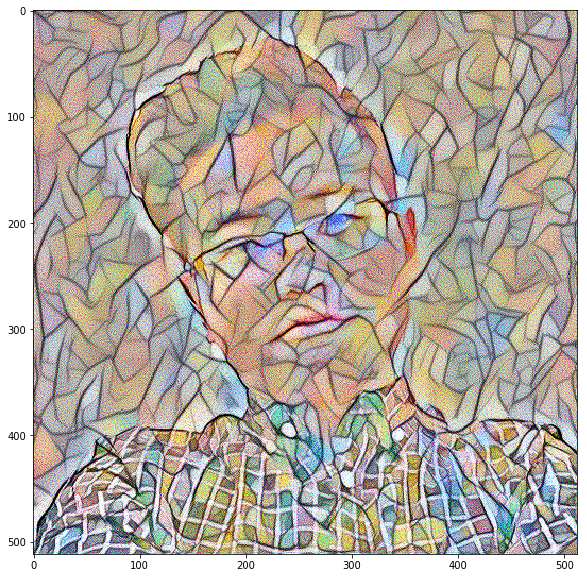

# Style Transfer风格迁移的Keras实现

## 成果

内容图

风格图

融合图

## Loss 定义

### Content Loss

即融合图片和内容图之前的Loss，这里使用VGG 卷积网络第二层卷积后的feature map计算MSE

### Style Loss

风格Loss。在VGG网络的中间若干几层，提取style和combination的“风格值”，并求MSE差异。这里的“风格值”是图像tensor重新排列维度,batch_flatten后，其和自身转置的矩阵点乘。

### Variation Loss

抑制成图片噪点过多的Loss，让最终图像更平滑。数学表示是一个图像和它向x/y不同方向平移1个pixel后的MSE之和。我尝试如果去掉这个Loss，生成的效果会有很多噪点，如图：

